# Cadence — Thruster workflow assessment

Assessment of the v0 app (`web/`) as a tool for a **propulsion manager** standing
up a new thruster system: new parts, iteration, purchase orders, workshop
handoff, and multiple thrust configurations on one test cell.

Written 2026-08-13 against `main` (`d299fed`, industrial UI + phases 1–10) after
a live walkthrough on a **wiped database** (not the CH4-feed seed). This is a
product evaluation of the job-to-be-done, not a concept-to-code gap list.
`CONCEPT.md` remains the locked thesis. Where Cadence matches the freeze, that
is called out. Where the freeze is satisfied but the **job still fails**, that
is the point.

Screenshots: [`docs/thruster-walk/`](docs/thruster-walk/).

---

## 1. Verdict

**Cadence can represent a thruster program. It cannot run one.**

A propulsion manager can, today, author a 50N ACS BoM, release an article
config and a vacuum-cell config, buy fittings, pretend make-parts appeared in
the shop, kit a serial, bind a hot-fire, stamp a procedure, and cut a 70N
stretch. Every object in CONCEPT §2’s “first win” exists.

The path between those objects is a **13-destination scavenger hunt** with no
program, no work order, no thrust envelope, and no way to keep two live thrust
ratings on one bench without reading the fine print on a supersede checkbox.
The product impersonates `m.chen` on every write. Overview on an empty database
tells the manager to run `npm run db:seed`.

| Area | Usability (can a human do the job?) | Effectiveness (does the job stay true?) |
|------|--------------------------------------|------------------------------------------|
| Stand up a new thruster (parts → serials → cell) | **Poor** — five pages before a BoM | **Partial** — objects exist; no program/family |
| Config authoring (BoM, tests, procs, effectivity) | **Awkward** — CSV is the real UI, buried | **Good** once you know the ritual |
| R3 release | **Good** — two-person gate works | **Good** — self-approve is refused |
| Buy path (PO → receive) | **Poor** — invent a PO number, one line at a time | **Thin** — qty/lot/location only; no certs |
| Make path / workshop handoff | **Poor** — “Create lot” is not a job | **Weak** — sourcing=make is a badge |
| Floor kit → as-built | **OK** for one kit | **Fragile** — a second Kit click doubles the as-built |
| Run / first fire | **Awkward** — ack gaps to unlock Start | **Partial** — bind is real; evidence is a status enum |
| Iterate injector / second thrust class | **Misleading** — three cut-in paths | **Dangerous** — default release **kills** the 50N config |
| Multi-config test matrix on one cell | **Missing** | **Missing** — name strings, not envelopes |
| Trace | **Good** for lookup | **Good** — until as-built is doubled |

Net: Cadence is already a **configuration-control plane with a kit button
taped on**. It is not a propulsion program tool. That is harsher than
CONCEPT’s “designers first / thin MES” — the freeze’s first win still asks a
lead to build serials, hand the bench a recipe, and cut N+1 overnight. Those
jobs are possible. They are not operable.

---

## 2. Method and persona

Persona: **j.volkov**, propulsion manager, 50N ACS proto. Not a Cadence
developer. Not `m.chen`.

Job, in order:

1. Create the thruster parts (injector, chamber, nozzle, valve, PT, TCs, AN-4).
2. Create two proto serials (`THR-001`, `THR-002`) and vacuum cell `VAC-CELL-1`.
3. Write assembly and cell-commissioning procedures; declare leak, thrust, and
   base-pressure tests.
4. Release article config `THR-50N-A` (R3) and stand config `VAC-CELL-A` (R2).
5. Write a PO for buy parts; get make parts into the shop.
6. Hand `THR-001` to the workshop (kit / traveler).
7. Plan and run a first fire on the cell.
8. Iterate the injector (rev B, 0.5 mm orifice, 70N stretch) and keep **both**
   50N and 70N as planned thrust configurations on the same cell.

Walked on a wiped SQLite DB so empty-product behavior was visible. Then the
same DB through kit, run, cut-in, and trace. Cross-checked write paths in
`web/src/lib/actions.ts` and domain modules where the UI lied or went silent.

---

## 3. The walk, step by step

### 3.1 Empty product — no on-ramp

Thirteen top-level destinations, grouped but not ordered as a job:

`Overview · Catalog · Configs · Articles · Stands · Floor · Runs · Procedures · Trace · Change · Inventory · Kits · Procurement`

Empty Overview is a three-step list (Catalog → Configs → Runs) that **skips**
articles, stands, procedures, tests, inventory, and the floor. Then:

```text
Or load demo data: npm run db:seed
```

A manager standing up a thruster is told to run npm. The bind-run form is
still rendered with **zero article/stand options** and is clickable. Floor
empty state is honest (“No articles yet”). Change empty state points at
Configs — the only empty page that names the next object correctly.

There is no “new program” wizard. There is no thruster / vehicle / family
object. Identity is a free-text `by` field defaulting to `m.chen` on every
form that writes.

### 3.2 Catalog — nine submits for nine parts

Created: `THR-INJ-50`, `THR-CH-50`, `THR-NZL-50`, `THR-VLV-F`, `THR-PT-3K`,
`THR-TC-K`, `FTG-AN4`, plus cell instruments `LC-100N`, `DAQ-8CH`.

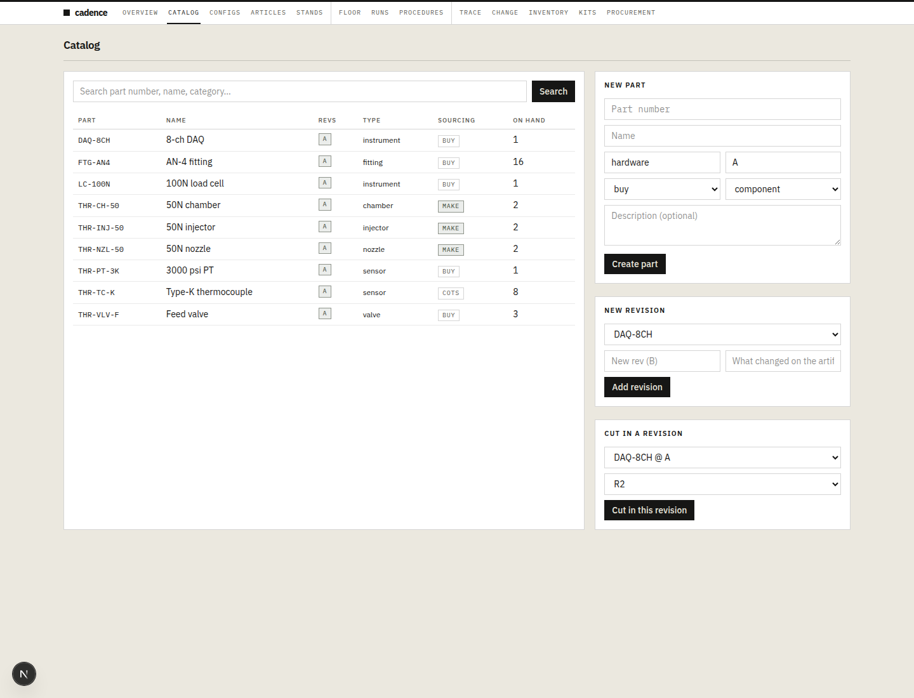

Each part is its own form: number, name, category, sourcing, kind. No CSV/bulk
create for the catalog (CSV exists only later, for config pins). A real ACS
BoM is dozens of lines; this is a demo tax.

`kind = assembly` is a badge. You cannot model injector+chamber+nozzle as a
thruster assembly with structure. The 50N thruster **is** an assembly in the
manager’s head; in Cadence it is seven sibling pins on a config.

Articles (`THR-001`, `THR-002`) and the stand (`VAC-CELL-1`) are **separate
pages** with no link from the parts just created. Floor with articles but no
released config requires clicking **Show** (GET form) to learn that nothing
resolves.

### 3.3 Procedures page is also the test catalog

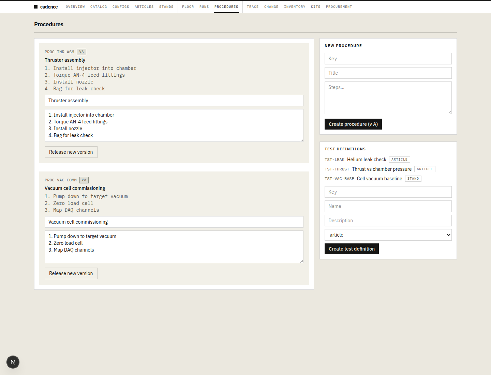

`PROC-THR-ASM` (numbered assembly steps in a textarea) and `PROC-VAC-COMM`
live here. So do `TST-LEAK`, `TST-THRUST`, `TST-VAC-BASE`. Tests are a key +
name + `appliesTo` (article / stand / either). **No limits, units, or pass
criteria.** “50 ± 3 N at 1.2 MPa Pc” cannot be a requirement; it is a note you
hope someone reads.

Configs can only **Require** / **Link** defs that already exist. Authoring a
thruster config means leaving the BoM, visiting this page, coming back, and
picking from a dropdown.

The procedure body **is** parsed into executable steps later (that part
worked). The test definition is not parsed into anything.

### 3.4 Config `THR-50N-A` — the ritual

Path: Configs → **Create empty draft** (key, name, kind=article, risk=R3) →
land on an empty BoM that can already **Request release**.

CSV import (`find,part,rev,qty,notes`) is the only scalable authoring path and
sits **under** the empty table and the one-by-one Add line picker. It works.

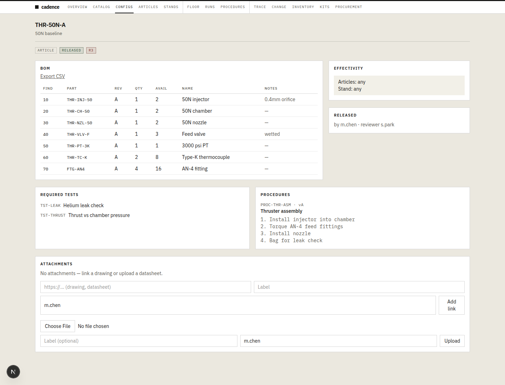

Then, still on the same page:

- **Add effectivity** defaults to `any article` / `any stand`. That is the
  correct CONCEPT default and the wrong default for a manager who will later
  want 50N on `THR-001` and 70N on `THR-002`. The words are “serial range” and
  “explicit articles”.
- **Require** TST-LEAK, Require TST-THRUST, **Link** PROC-THR-ASM — one
  dropdown each, no inline create.
- R3: Request release as `m.chen` (default). Approve as `m.chen` is refused
  (“Reviewer must be someone other than the requester”). Approve as `s.park`
  releases. This gate is real and correct.

Stand config `VAC-CELL-A` is the **same list and the same form**, kind=stand,
R2 (single-person **Release config**). Nothing in the configs table says
“this is a thruster” vs “this is a cell” except a badge and the name you typed.

### 3.5 Floor before stock — recipe without a buy button

After both configs are released, Floor → pick article/stand → **Show**:

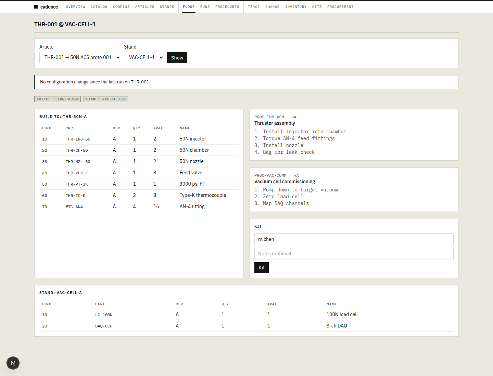

The recipe is the best screen in the product: find, part, rev, qty, **avail**,
name, plus the bound procedures, plus a Kit form. Article config and stand
config are both visible. That is CONCEPT §3–4 done right.

Shortages are a red “0 short”. **You cannot open a PO from Floor.** “Open PO
for shortages” lives on Change, which does not exist as a job until you have
two configs to compare.

### 3.6 Buy path — invent a PO number

Procurement: type `PO-THR-001` and a supplier. No auto-number. Statuses are
open → ordered → received.

Lines are added one at a time through a filterable part picker that includes
**make** parts (injector, chamber, nozzle) you would never buy. No filter by
sourcing. No paste-a-buy-list. Unit cost is optional decoration.

**Mark ordered**, then **Receive into stock** with a location. Receive writes
lots. If location is left blank, domain code stamps `PROTO-CAGE` — leftover
demo geography, not a cage the manager named.

No packing slip, no CoC, no material cert, no line-level receive. A wetted
valve PO in propulsion is a cert trail; Cadence is a qty+lot stamp.

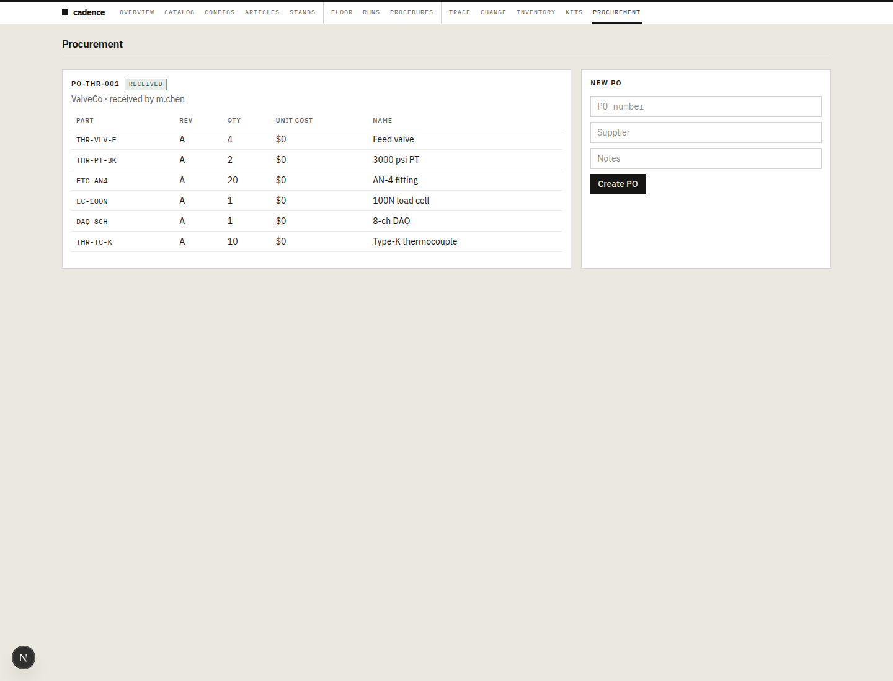

### 3.7 Make path — the workshop does not exist

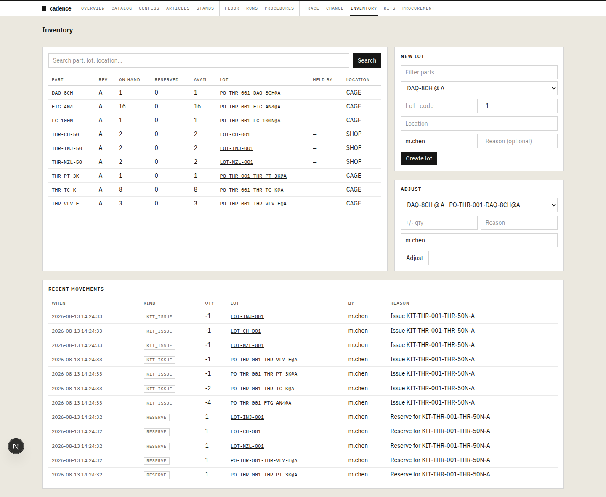

`Create lot` on Inventory is how the injector, chamber, and nozzle “arrive”
from the machine shop. Sourcing=make is a badge on the catalog row. There is
no work order, traveler, expected date, or “issue to shop”. Handing a chamber
to the workshop is indistinguishable from finding one on a shelf.

This is the largest CONCEPT miss relative to module map §9
(“Manufacturing (MES) — work orders / runs, travelers, as-built”). Runs exist.
Work orders do not. The freeze deferred operator-first MES polish — not the
existence of a job to make a part.

### 3.8 Kit — the only workshop handoff, and it is sticky

Floor → Kit (still defaulting to `m.chen`) redirects to a kit. **Allocate
remaining**, then **Issue kit (stamp as-built)**. Lots reserve, then consume.
As-built lines appear on `THR-001` with lot/PO links. That loop is real.

It is also the **only** handoff. No pick list print. No “ready for shop”
state. No machinist signature distinct from the kitter. The traveler is a
procedure textarea the floor happens to render.

Worse: Floor **keeps showing Kit** after issue. A second Kit + issue on the
same serial (easy to do; the button never goes away) stamps a **second full
as-built**. Article `THR-001` then shows `IN_BUILD`, **7 deltas vs THR-50N-A**,
qty mismatch 1 designed / 2 built on every line.

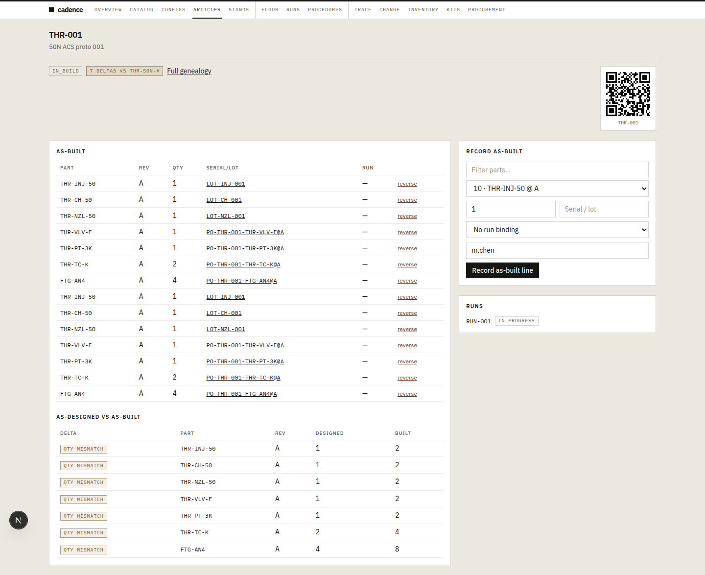

That is not thin MES. That is a genealogy lie.

### 3.9 First fire — bind is good; evidence is a stamp

Runs: pick article + stand → **Resolve configs & bind run**. Cadence binds
`THR-50N-A` + `VAC-CELL-A` into `RUN-001` (name/id are not asked; the product
invents the key). Gaps for leak, thrust, and cell vacuum appear immediately.
Record-and-warn is visible. That matches CONCEPT §6.

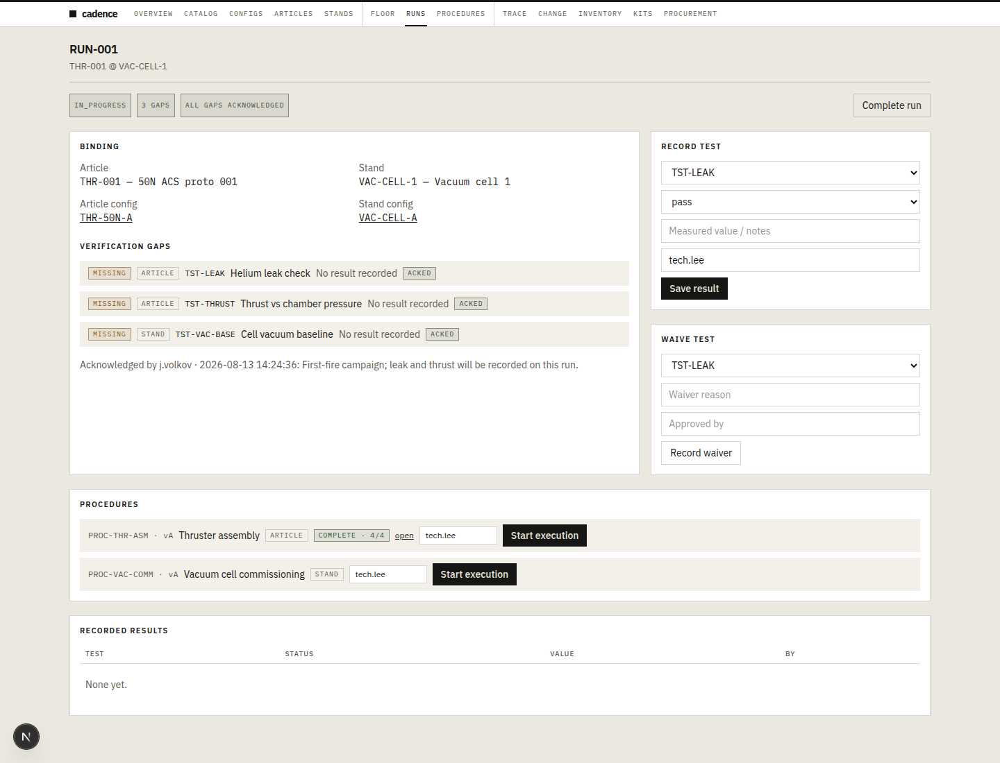

**Start run** refuses until gaps are acknowledged. The manager types a reason
(“First-fire campaign; leak and thrust will be recorded on this run”) to
unlock a button. The ack does not schedule the tests. It is a waiver-shaped
object in front of the first fire.

Procedure execution **does** work: `PROC-THR-ASM` body lines become steps;
Record step 1…4; 4/4 complete. `PROC-VAC-COMM` is a second Start execution —
cell commissioning is not on a dispatch board, it is another button on the
same run.

Record test: dropdown of **missing** tests, status pass/fail/waived, free-text
“Measured value / notes”. Saving `48.2 N (nowhere to put units or limit)`
against **TST-LEAK** (first in the dropdown) is accepted. Thrust is still
missing. There is no field for 48.2, no unit, no 50±3 N limit, no comparison.

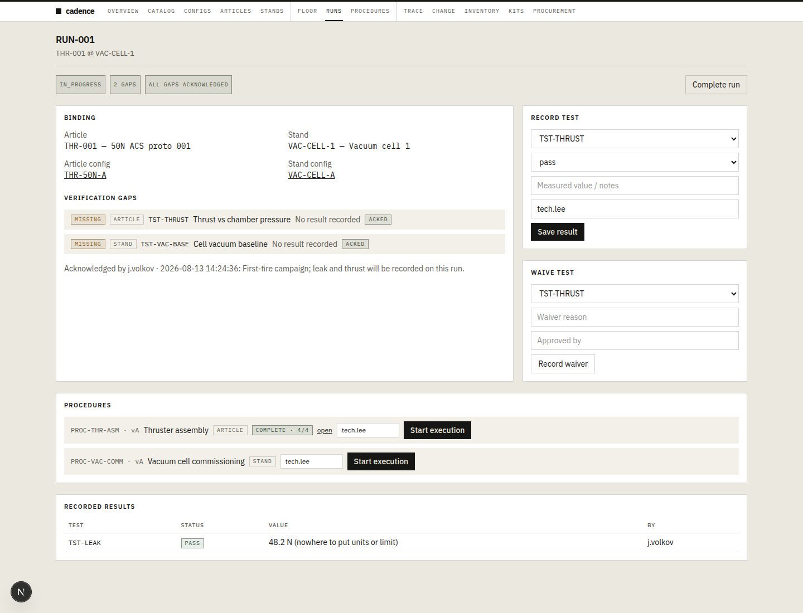

### 3.10 Iterate — three cut-in paths, default kills 50N

Catalog: **Add revision** `THR-INJ-50` → B (“0.5mm orifice for 70N stretch”).

Then the product offers **three** ways to cut that into a thruster config:

1. **Cut in this revision** (catalog) — drafts every *released* config that
   pinned an older rev. Produced `THR-50N-A-B` (generated key) as a draft.
   Easy to ignore because the key is ugly and it is not “the 70N config”.
2. **Create draft** based on `THR-50N-A` (configs) — the path a manager
   actually uses. Produced `THR-50N-B` “70N stretch”. **Copied pins as-is,
   still injector rev A.** Change compare A vs B draft: **BoM delta None yet.**
3. Inline Save on a draft BoM line to swap A→B — exists, easy to miss.

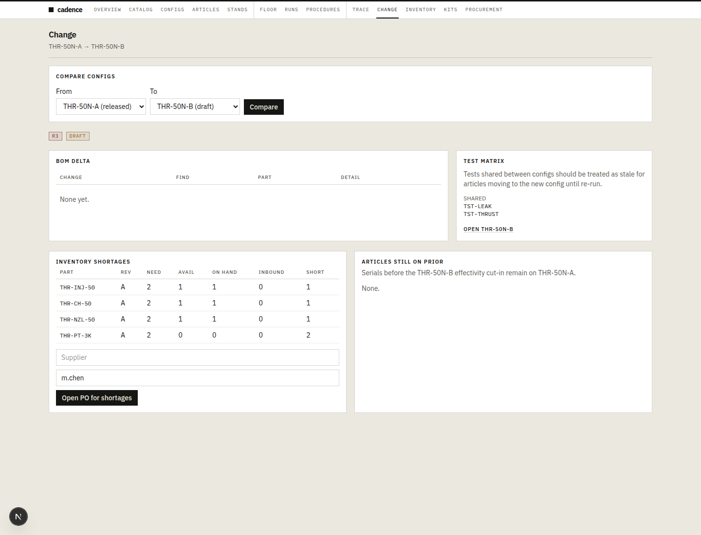

Release of `THR-50N-B` (R3, reviewer `s.park`) defaults **Supersede the base
config** to on. Result: `THR-50N-A` is **superseded**. Floor for `THR-001 @
VAC-CELL-1` now builds **THR-50N-B** and shows “Configuration changed since
the last run: THR-50N-A → THR-50N-B”. Injector on the recipe is still **rev A**.
PT is `0 short` (the doubled kit ate the lot).

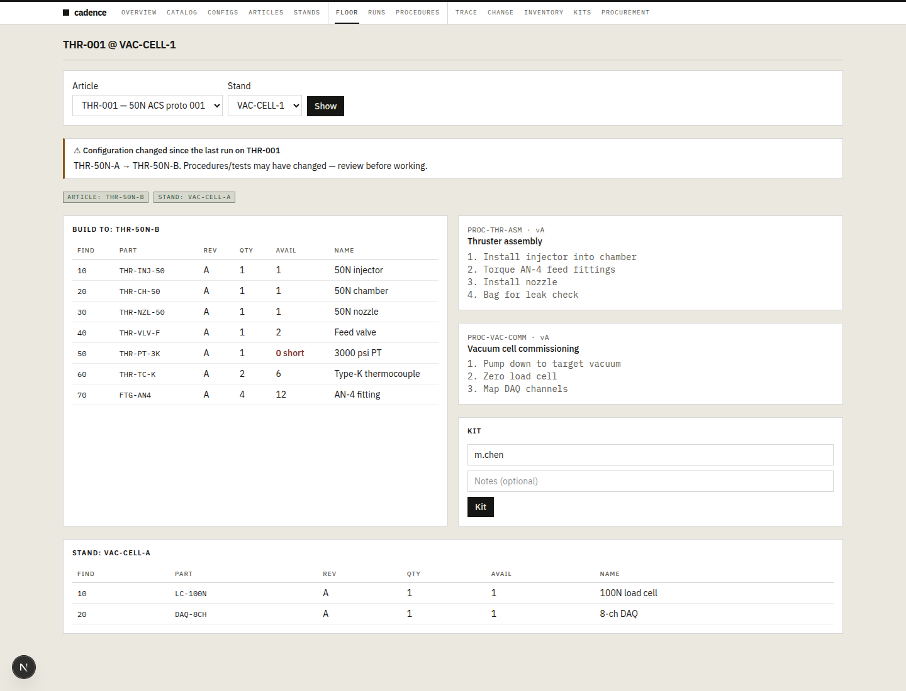

There is no conflict banner. The 50N configuration is dead. The 70N
configuration does not include the orifice change that justified it.

Unchecking supersede and leaving any/any effectivity **would** conflict
(CONCEPT §4: equal specificity → do not auto-pick). That path is a checkbox
helper: “Uncheck for a partial cut-in — the base stays live for serials this
config doesn’t cover. Keep effectivities from overlapping.” A propulsion
manager planning 50N Thursday and 70N Friday is not going to decode that.

There is no thrust class, no envelope, no campaign object. `THR-50N-A` vs
`THR-50N-B` is a name string.

### 3.11 Trace and Overview after

Trace `THR-001` shows build history (lots and PO-derived serials) and the run
with `THR-50N-A + VAC-CELL-A`, 1 pass / 1 other. Useful. Also shows the
**doubled** as-built as if it were truth.

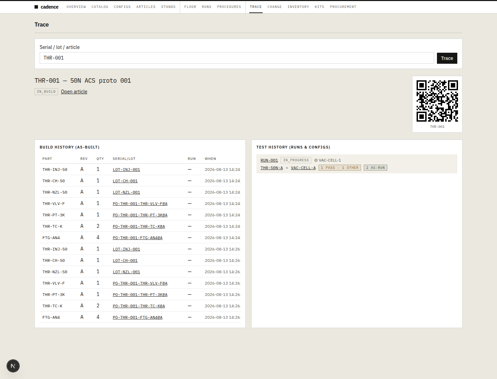

Overview becomes a delta dashboard: `THR-50N-A → THR-50N-B`, 0 BoM changed,
4 short, 0 articles still on N. Verification: TST-LEAK **stale** (config N+1
did that correctly), TST-THRUST missing, TST-VAC-BASE missing, **0 pass**.
The leak result we recorded is no longer a pass because the config moved.

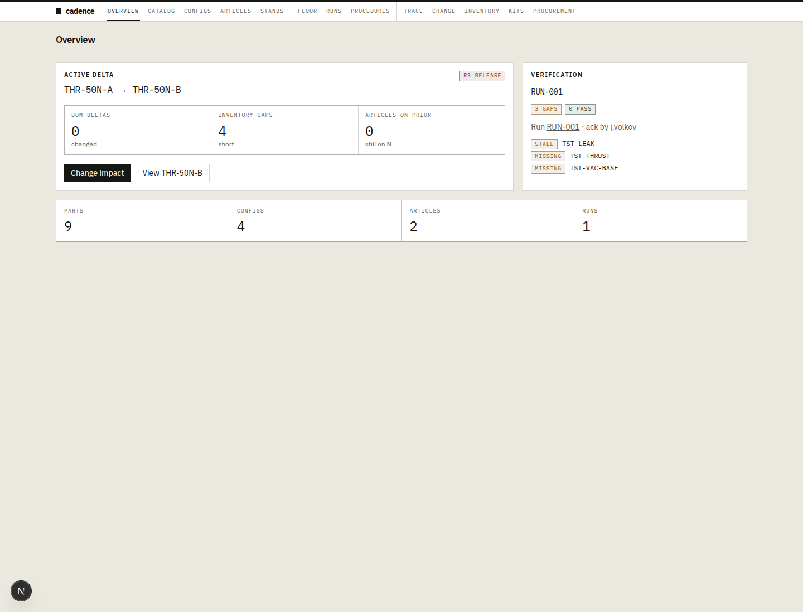

That stale-test behavior is CONCEPT §6 done right. It is also how a manager
learns that recording 48.2 N on the wrong dropdown row did not create a
thrust point, and that cutting a config without changing the BoM still
invalidates evidence.

---

## 4. Unnecessary steps

These are clicks that do not earn their keep for this job.

1. **Visit five pages before a BoM exists.** Catalog, Articles, Stands,
   Procedures, Configs. The empty Overview’s three-step list is a lie; the
   real minimum is five, plus Inventory/Procurement/Floor/Kits/Runs to
   execute.
2. **Create tests and procedures on another page before the config can pin
   them.** Require/Link with no inline create.
3. **Click Show** on Floor and Compare on Change. GET forms, no live update.
4. **Invent a PO number.** Then Mark ordered, then Receive — three statuses
   for a proto buy that could be “open PO → received”.
5. **Add PO lines one part at a time**, including make parts in the picker.
6. **Create lot** for every make part, by hand, as if the shop already
   finished.
7. **Acknowledge gaps to unlock Start run** on a first article that has never
   been fired. Record-and-warn is the rule; the extra form is a lock.
8. **Kit from Floor only**, not from the config you just released. Then
   Allocate remaining, then Issue — three kit states for a seven-line proto.
9. **Re-type `m.chen` → `j.volkov`** on every write (or forget and pollute
   the audit as the seed user).
10. **Cut a config, then separately swap the pin that motivated the cut.**
    Create-draft-from-parent does not apply the new part rev.

---

## 5. Unclear workflow

Places where a competent propulsion manager gets lost without a Cadence
tutorial.

| What you see | What it actually means |
|--------------|------------------------|
| 13 nav items, no “you are here” in the job | Spine is Catalog → Config → Floor → Run → Change; Kits/Procurement/Inventory are side quests |
| Procedures page | Also the test-definition catalog |
| `kind = assembly` | Cosmetic. Structure lives only as config pins |
| Create empty draft **and** Create draft **and** Cut in this revision | Three N+1 mechanisms; only cut-in swaps the rev; only create-draft lets you name the 70N config |
| Effectivity: any / serial range / explicit articles | How to keep 50N and 70N both live. Hidden until you deadlock or supersede |
| “Supersede the base config” (checked) | Releases of a child **retire the 50N config**. Uncheck + overlapping any/any = Floor conflict |
| Floor title `THR-001 @ VAC-CELL-1` | Same app route as “Floor”; the page is a recipe viewer, not a shop dispatch board |
| `RUN-001` | You never named the hot-fire |
| Record test dropdown | Missing tests only; first row is easy to mis-file (leak got the 48.2 N) |
| Overview “Active delta” | Useless until two released configs exist; then it is the overnight-change dashboard |
| Kit still offered after issue | Second issue doubles as-built. Looks like a normal button |
| `PROTO-CAGE` | Blank receive location. Not a place in the building |

---

## 6. Missing features (job vs freeze)

Split on purpose. CONCEPT §2 out-of-v0 items are not scored as bugs. They are
still **job holes**.

### 6.1 In wedge, still missing

These are in the v0 spine (CONCEPT §2 first win, §9 module map) and failed
the walk.

- **A program / family / “this is the ACS thruster”.** Configs are a flat
  list of article-kind and stand-kind rows.
- **Bulk catalog create.** Config CSV exists; part CSV does not.
- **Test limits and structured measurements.** Evidence is pass/fail/waive +
  a notes string. CONCEPT: “Tests are first-class and always produce
  structured evidence.”
- **Work order / traveler for make parts.** Kit issue is the only workshop
  verb. Make lots are a stock form.
- **Demand → PO from the recipe.** Floor shows short; Change can open a
  shortage PO; Floor cannot. Procurement does not know the config.
- **PO identity and certs.** Auto-number; CoC/material cert link on receive;
  filter picker to buy/cots.
- **Session identity.** Stop defaulting `m.chen`.
- **Empty-product onboarding that is not npm.**
- **Idempotent kit.** One open kit per (article, config); Floor must not
  stamp a second as-built as the happy path.
- **Cut-in that applies the change you just made.** Create-draft-from-parent
  should at least offer “also swap THR-INJ-50 A→B”.
- **Safe default for two live configs.** Supersede-on should not be the
  default when the manager’s job is “50N and 70N on VAC-CELL-1”.
- **Draft preview on Floor.** Drafts are invisible there (correct per
  released-only) with no “preview recipe” from the config itself.

### 6.2 Out of v0, still the job

Do not implement these to “finish v0”. Do not pretend the walk succeeded
without them either.

- CAD/PLM import (locked out). The catalog tax is the cost of that lock.
- Assembly trees / EBOM-MBOM (kind=assembly is a placeholder).
- Rate production, MRP, multi-warehouse.
- Hard gating on missing tests (record-and-warn is working).
- Operator-first MES polish — but **some** work-order object is in the
  module map, not in the app.
- Test campaign / calendar (“THR-001 50N Thursday, THR-002 70N Friday”).
- Thrust / operating envelope as data (N, Pc, propellant) on a config.
- DAQ ingest (freeze: raw DAQ later; structured evidence still required).

---

## 7. What worked (keep)

The configuration-control plane is not vapor. These pieces earned the walk.

1. **Article config and stand config are separate**, and a run binds both.
   First fire on `THR-001 @ VAC-CELL-1` resolved `THR-50N-A` + `VAC-CELL-A`
   without fake part revs on the cell.
2. **Released configs are immutable records**; drafts edit in place. R3
   two-person review refuses self-approve.
3. **CSV pin import** is real and is how any BoM larger than a handful
   should be authored.
4. **Floor recipe** (find / part / rev / qty / avail + procedures + stand
   BoM) is the right shop glance.
5. **Kit allocate → issue → as-built consume** (the first time) is the
   as-designed / as-built loop CONCEPT §5 asked for.
6. **Record-and-warn** on the run: gaps listed, ack is an explicit object,
   N+1 marks leak **stale**. Not silent green.
7. **Procedure body → step records.** Numbered textarea becomes 4/4
   execution. That is more MES than the rest of the app admits.
8. **“Configuration changed since last run”** on Floor after B released.
9. **Change impact** still computes test-stale and inventory short when the
   BoM delta is empty — useful, and also an indictment of the cut-in UX.
10. **Trace** by serial/lot/article, with QR, lots, and PO-derived
    identifiers.

---

## 8. Priority (assessment only — do not treat as a build order)

If the next work is “make this operable for a propulsion lead,” the order
that would have changed **this** walk:

1. **Stop lying on as-built** — one kit per (article, released config);
   Floor Kit button after issue should open the existing kit, not mint a
   twin.
2. **Session identity** — no more `m.chen` defaults.
3. **Empty onboarding** — Catalog → Articles/Stands → Procedures → Config
   as a real sequence; delete `npm run db:seed` from the Overview a manager
   sees.
4. **Cut-in that matches intent** — creating `THR-50N-B` from `THR-50N-A`
   after adding injector B should swap that pin or say it didn’t.
5. **Two live thrust configs** — effectivity UX in human words (“these
   serials” / “this cell”) and a default that does not supersede the 50N
   article when you meant to add a 70N variant.
6. **Measurements** — test defs with unit + limit; results as numbers
   against that limit; stop putting 48.2 N in a notes field on the leak row.
7. **Make path** — a work order / traveler object, even a thin one, so
   “hand the chamber to the shop” is not Create lot.
8. **Buy path** — auto PO number, sourcing filter, Open PO from Floor
   shorts, cert attachment on receive.
9. **Bulk catalog** and inline test/procedure create from the config.
10. **Program object** — something above configs that means “ACS thruster
    family” so 10N / 50N / 70N are variants, not unrelated rows.

---

## 9. Score against CONCEPT “first win”

A propulsion/thermal design lead can:

| # | First win (CONCEPT §2) | This walk |
|---|------------------------|-----------|
| 1 | Model a cryo subsystem BoM (and key stand equipment) | **Yes, painfully.** Nine form submits + CSV pins. No assembly structure. |
| 2 | Release Article Config N and Stand Config M with procedures + required tests | **Yes.** R3 two-person works. Tests have no limits. |
| 3 | Build a handful of proto serials; capture as-built | **Once.** Second Kit destroys the genealogy. No make work order. |
| 4 | Bind a bench Run to (article, article config, stand, stand config) | **Yes.** Best moment in the walk. |
| 5 | Record test results; see missing/failed/stale as warnings | **Warns, yes. Records, barely.** Status enum + notes. Leak went stale on N+1. |
| 6 | Cut Config N+1 overnight (delta + impact: serials, kits, stale tests) | **Partial.** Three cut paths; default supersede; 0 BoM delta if you forget the pin swap; stale tests still fire. |
| 7 | Next bench day runs against the new configs without rewriting tribal process | **Floor switches to B.** Injector rev did not. 50N is gone. PT is short. |

Cadence’s configuration spine is real. The propulsion-manager job around it
is a pile of forms in 13 places, several of which fight the job (supersede,
double kit, `m.chen`, npm on Overview).

---

*Walked as j.volkov, 50N ACS proto, vacuum cell VAC-CELL-1, 2026-08-13.
Not a seed demo.*
